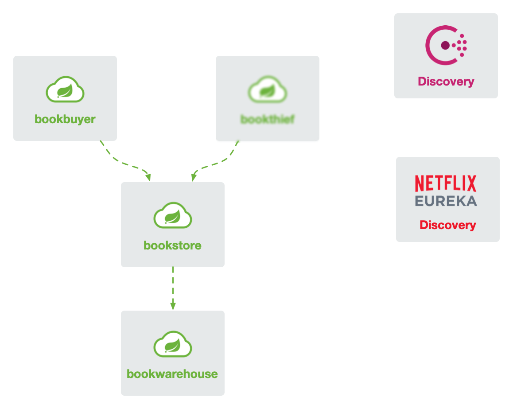

# Bookstore Demo

This is a demo project for Bookstore implemented with SpringCloud. You can get the architecture of this project from the following picture.



Currently, it takes Consul as discovery server and will support Eureka or Nacos in the future.

## How to run

This demo supports two discovery servers: Consul and Eureka. You can choose one of them to run.

### Maven profile

You need to specify the profile for both Maven and Spring Boot. The profile can be `consul` or `eureka`. Such as:

```bash
# enable Consul dependencies
mvn clean install -P consul 
# enable Eureka dependencies
mvn clean install -P eureka 
```

### Spring Boot profile

All modules will run with profiles `dev` and `consul` by default. You can change it with `-Dspring.profiles.active=xxx` option (it's `-Dspring-boot.run.profiles` with `mvn spring-boot:run`).

> - `dev` profile will assign different port for each module.
> - `prod` profile will assign same port 14001 for each module. It suits for running in Kubernetes.
> - `consul` profile will register the service to Consul server. Combining with `dev` profile, its address is `localhost:8500`. Combining with `prod` profile, its address is `consul.default:8500`.
> - `eureka` profile will register the service to Eureka server. Combining with `dev` profile, its address is `localhost:8761`. Combining with `prod` profile, its address is `eureka.default:8761`.


```bash
# enable Consul profile
mvn spring-boot:run -f bookwarehouse -P consul -Dspring-boot.run.profiles=consule,dev
# enable Eureka profile
mvn spring-boot:run -f bookwarehouse -P eureka -Dspring-boot.run.profiles=eureka,dev
```

### Consul

First of all, you need to start Consul server. You can follow [official doc](https://www.consul.io/downloads.html) and start it.

Or run it with docker:

```bash
docker run -d --name consul -p 8500:8500 consul:1.5.3
```

Then, you can start the project with the following command:

```bash
mvn spring-boot:run -f bookwarehouse -P consul -Dspring-boot.run.profiles=consule,dev
mvn spring-boot:run -f bookstore -P consul -Dspring-boot.run.profiles=consule,dev
mvn spring-boot:run -f bookbuyer -P consul -Dspring-boot.run.profiles=consule,dev
```

### Eureka

It's same to start Eureka server first. You can choose [official doc](https://spring.io/projects/spring-cloud-netflix) to run it, or run with Docker

```bash
docker run -d --name eureka -p 8761:8761 flomesh/samples-discovery-server:latest
```

Then, you can start the project with the following command:

```bash
mvn spring-boot:run -f bookwarehouse -P eureka -Dspring-boot.run.profiles=eureka,dev
mvn spring-boot:run -f bookstore -P eureka -Dspring-boot.run.profiles=eureka,dev
mvn spring-boot:run -f bookbuyer -P eureka -Dspring-boot.run.profiles=eureka,dev
```

## Build docker image

You can build docker image with the following command. Note, you should execute this command on x86_64 platform.

It will build and push images for all modules for both Consul and Eureka on one execution. 

```bash
./build.sh
```

The script will push images to Docker Hub automically if you set `DOCKER_USERNAME` and `DOCKER_PASSWORD` environment variables in advance.

### Run in Kubernetes

Running in Kubernetes is very easy. You can run it with the following command: 

```bash
kubectl create namespace bookstore
kubectl create namespace bookbuyer
kubectl create namespace bookwarehouse

kubectl apply -n default -f manifets/consul.yaml

kubectl apply -n bookwarehouse -f manifests/consul/bookwarehouse-consul.yaml
kubectl apply -n bookstore -f manifests/consul/bookstore-consul.yaml
kubectl apply -n bookbuyer -f manifests/consul/bookbuyer-consul.yaml
```

All applications will running in `prod` profile. 

**You can try with Eureka by changing `consul` to `eureka` in the above commands.**